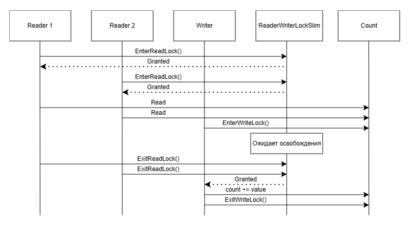

# CountServer

Потокобезопасный счётчик с REST API, реализованный на ASP.NET Core. Поддерживает параллельное чтение и эксклюзивную запись через примитив синхронизации ReaderWriterLockSlim.

## Быстрый старт

### Запуск через Docker Compose

```bash
docker-compose up --build
```

После запуска сервисы будут доступны по адресам:
- Swagger: http://localhost:8080


| Метод | Endpoint | Описание |
|-------|----------|----------|
| `GET` | `/api/count` | Возвращает текущее значение счётчика |
| `POST` | `/api/count/add` | Прибавляет переданное значение к счётчику и возвращает обновлённый результат |

## Cхема работы



## Что я сделал
- Статический класс как хранилище состояния. По требованию ТЗ сервер реализован как static class. В production-системах предпочтительнее Singleton через DI — это упрощает тестирование и замену реализации.
- In-memory хранение. Счётчик хранится только в оперативной памяти процесса. При перезапуске контейнера/процесса значение сбрасывается в 0. Персистентность не требовалась.
- Тип int для счётчика. Диапазон значений ограничен [-2 147 483 648; 2 147 483 647]. Переполнение не обрабатывается явно — поведение определяется семантикой C# (в unchecked-контексте происходит silent overflow).
- Один процесс. Решение рассчитано на работу в рамках одного процесса. Для кластера из нескольких инстансов потребовался бы распределённый lock (Redis, ZooKeeper) или база данных.
- Swagger включён в Development. В production-режиме Swagger по умолчанию отключён (стандартная практика безопасности).

## Ограничения
- Нет персистентности — значение счётчика теряется при перезапуске.
- Нет валидации диапазона — клиент может передать любое int-значение, включая отрицательные.
- Нет rate limiting — клиенты могут спамить запросами без ограничений.
- Нет аутентификации/авторизации — API открыт для всех.
- Блокировка на уровне всего сервера — все операции с счётчиком сериализуются через один lock; при высокой конкуренции писателей это может стать узким местом.
- Отсутствие graceful shutdown — значение не сохраняется при остановке контейнера.

## Известные недостатки
- Статическое состояние усложняет тестирование. Unit-тесты влияют друг на друга через общий _count. Требует явного сброса между тестами.
- ReaderWriterLockSlim не поддерживает async/await. Методы GetCount и AddToCount синхронные. В высоконагруженном ASP.NET Core приложении это может привести к истощению пула потоков (thread pool starvation).
- Отсутствие идемпотентности. Повторный POST /add с тем же value увеличивает счётчик повторно — клиент не может безопасно повторить запрос при сетевой ошибке.
- Нет версионирования API. Endpoint /api/count не имеет префикса версии (/api/v1/count), что затрудняет backward-compatible изменения в будущем.
- Docker-образ не оптимизирован по размеру. Используется полный aspnet:8.0 runtime; для production можно применить chiseled Ubuntu-образ (~30 МБ вместо ~200 МБ).
